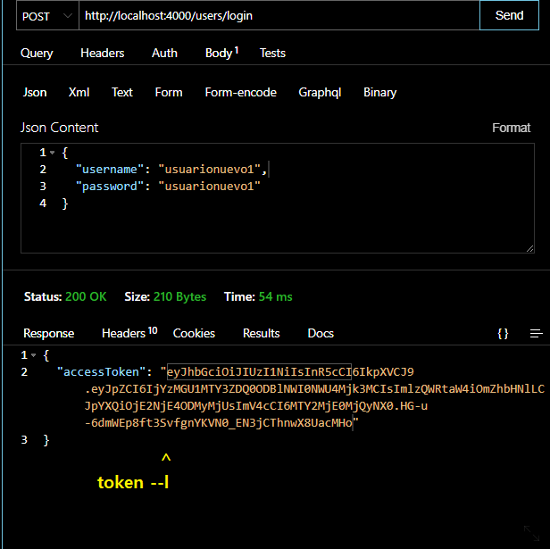

## guia para users

## login: ##

Al logearse se recibe ```un token```


<p align="left">
  
</p>


Para tener acceso a las rutas protegidas, ```ese token``` debe usarse en el ***Header***


<p align="left">
  
</p>


